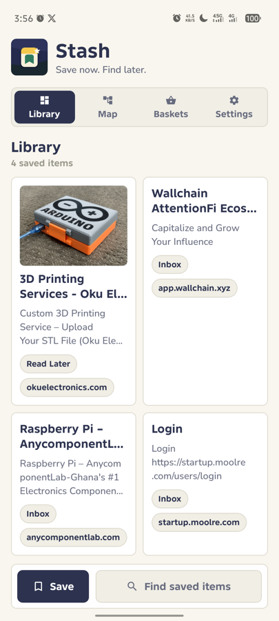
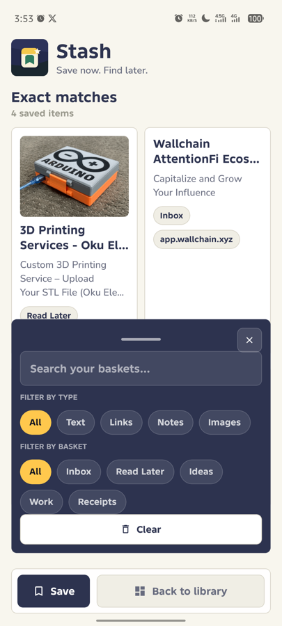
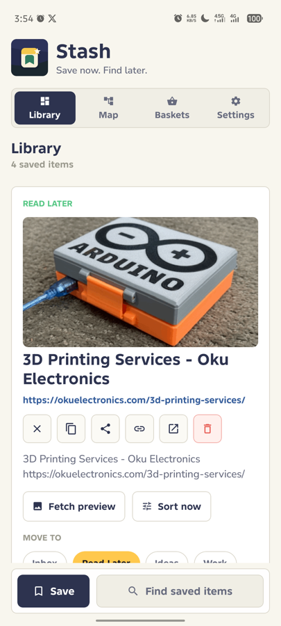

# Stash

Stash is a QVAC-powered private Android save-and-find app. It captures links, notes, copied text, receipt snippets, research fragments, and shared text from other apps, then keeps them searchable on the phone.

## Screenshots

<p align="center">
  &nbsp;&nbsp;
  &nbsp;&nbsp;
  
</p>

## Product Aim

- Use QVAC as the on-device organizer for summaries, tags, and basket hints after each save is stored.
- Save links and notes quickly from inside the app.
- Receive links and selected text from the Android share sheet.
- Organize saves into baskets such as Inbox, Read Later, Ideas, Work, and Receipts.
- Search locally across titles, text, URLs, domains, metadata, summaries, tags, and baskets.
- Keep private saves hidden until the user chooses to show them.

## Privacy Model

- No cloud account.
- Saves are written to local app storage.
- Link preview fetching is off by default.
- When link previews are on, Stash contacts the saved website to fetch title and description.
- Private items do not auto-fetch metadata.
- Android backup is disabled for the app.

## What Ships

- QVAC SDK integration using `QWEN3_600M_INST_Q4`.
- Android app built with Expo SDK 56 and React Native.
- Local JSON store with a backup file and export action.
- Empty first run with default baskets only; no demo saved items.
- Android `ACTION_SEND text/plain` and `ACTION_PROCESS_TEXT` intake.
- Copy support for saved item text.
- Baskets, search, privacy toggles, export, reset, and on-device sorting status.
- CPU inference path with unused Vulkan/OpenCL native libraries excluded from the release APK.
- Common project references in [`references/`](./references/README.md).

## Android Package

- App name: `Stash`
- Package ID: `com.qvac.stash`
- Scheme: `stash`
- Release APK output: `android/app/build/outputs/apk/release/app-release.apk`
- Local desktop copy after build: `~/Desktop/Stash-release.apk`

## Build

```bash
npm install
npm run typecheck
cd android
./gradlew assembleRelease
```

Install on a connected Android device:

```bash
adb install -r android/app/build/outputs/apk/release/app-release.apk
```

## Development

```bash
npm run prebuild:android
npm run android
```

For Metro only:

```bash
npm run start
```

## References

- [Build reference](./references/build.md)
- [Model reference](./references/model.md)
- [APK optimization reference](./references/apk-optimization.md)
